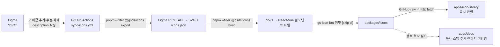

# 아이콘 자동화 파이프라인

> 이 문서는 GSSHOP AI-Ready 디자인시스템의 아이콘 파이프라인을 설명합니다.
> Cursor, GPT, Claude 등 어떤 AI 에이전트가 읽어도 동일하게 파이프라인 구조를 이해할 수 있도록 작성합니다.
> 워크플로우 파일명·트리거 조건 등 세부사항이 바뀌면 이 문서도 함께 갱신합니다.
> (v2: 실제 저장소 구조 확인 후 Flutter 생성·docs 반영·llms.txt 항목을 사실에 맞게 정정했습니다.)

## 1. 목적

Figma를 단일 진실원천(SSOT)으로 삼아 아이콘 에셋을 자동으로 추출·검증·배포합니다.
사람은 Figma에서만 작업하고, 코드 저장소와 사이트는 자동으로 동기화됩니다.
AI 에이전트가 이 구조를 이해하면, 아이콘 추가/수정 요청이 들어왔을 때
"Figma를 고쳐야 한다"는 것과 "코드를 직접 고치면 다음 동기화 때 덮어써진다"는 것을 판단할 수 있습니다.

**플랫폼-코드생성 매핑**: 지원 플랫폼은 Web / Android / iOS / Flutter이며, Android와 iOS는
네이티브가 아니라 Flutter로 크로스플랫폼 개발합니다. 코드 생성 타겟은
**React(Web) / Vue / Flutter(Android+iOS) / SVG(원본)** 4가지이지만, 넷의 형태가 다릅니다.
React·Vue는 **생성된 컴포넌트 파일**이고, SVG는 **원본**이며, **Flutter는 별도 파일 생성 없이**
`flutter_svg` 패키지로 SVG 원본을 렌더하는 **사용법 스니펫**입니다. 자세한 구분은 5장을 참고합니다.

## 2. 전체 흐름



1. **Figma 편집**: 디자이너가 아이콘 컴포넌트를 추가/수정/삭제하고, Variables description을 작성합니다.
2. **GitHub Actions 트리거**: 워크플로우 파일 `.github/workflows/sync-icons.yml`, 이름 `Sync Icons from Figma`.
   현재는 `workflow_dispatch`(수동 실행)만 활성화돼 있고, 매일 자정(`0 0 * * *`) 스케줄 트리거는 주석 처리된 상태입니다.
3. **런타임 세팅**: `pnpm/action-setup@v4`(pnpm 9), `actions/setup-node@v4`(Node 20, pnpm 캐시)로 환경을 구성합니다.
4. **Figma → SVG + icons.json**: `pnpm --filter @gsds/icons export` 스텝이 `FIGMA_TOKEN`(GitHub Secrets)
   인증으로 Figma REST API에서 아이콘을 가져와 SVG와 `icons.json`으로 추출합니다.
   SVGO 최적화·보안 처리(스크립트·이벤트 핸들러 제거, XSS 방어)가 적용됩니다. `svgo`는 `@gsds/icons`의
   devDependency이며, 정확한 처리 위치는 `packages/icons/scripts/export-icons.mjs`에서 확인합니다.
5. **SVG → 컴포넌트 빌드**: `pnpm --filter @gsds/icons build` 스텝이 **React·Vue 컴포넌트 파일을 생성**합니다.
   생성 결과는 `packages/icons/react/`, `packages/icons/vue/`에 들어갑니다(각각 아이콘 수만큼).
   **Flutter·SVG는 파일로 생성하지 않습니다** — 자세한 이유는 5장을 참고합니다.
6. **봇 계정 커밋**: `packages/icons` 변경분만 스테이징하고, 변경이 없으면 커밋을 건너뜁니다
   (`git diff --staged --quiet` 체크). 커밋 계정은 `gs-icon-bot`, 커밋 메시지는
   `chore(icons): 피그마 아이콘 동기화 [skip ci]` 형식이며 `[skip ci]`로 배포 워크플로우 무한 루프를 방지합니다.
7. **push 이후**: 이 워크플로우에는 Vercel 배포 스텝이 없습니다. `packages/icons` push를 감지해
   Vercel이 자체적으로 배포합니다(Vercel Git 연동). 다만 두 사이트의 반영 방식이 다릅니다 — 8장을 참고합니다.

## 3. 데이터 흐름 방향 (중요)

| 데이터 | 흐름 방향 | 비고 |
|---|---|---|
| 아이콘 SVG, 토큰 값 | Figma → JSON (단방향) | 코드에서 값을 직접 수정하면 다음 동기화 때 덮어써집니다 |
| Description 메타데이터 | JSON ↔ Figma (양방향 가능) | Google Drive 문서 등에서 정리 후 Figma로 역반영 가능합니다 |

**AI 에이전트 주의사항**: 아이콘 SVG나 토큰 값 자체를 코드 레벨에서 직접 수정하는 요청이 들어오면,
"Figma에서 먼저 수정해야 파이프라인이 덮어쓰지 않는다"고 안내합니다. `packages/icons`를 로컬에서
직접 수정해도 다음 `Sync Icons from Figma` 실행(현재는 수동 트리거) 때 덮어써질 수 있습니다.

**필요 시크릿**: `FIGMA_TOKEN`(GitHub Secrets에 등록된 Figma 액세스 토큰). 이 값이 없으면 export 스텝이 실패합니다.

## 4. 저장소 구조 (실측)

```
GSDesignSystem/ (모노레포, pnpm workspace)
├── apps/
│   ├── icon-library/        # 아이콘 갤러리 (Vercel 프로젝트 1). index.html 정적 사이트
│   └── docs/                # 문서 사이트, Vocs 기반 (Vercel 프로젝트 2)
│       ├── src/components/IconGallery.tsx   # icons.json 소비 갤러리
│       ├── public/icons.json                # ← packages/icons에서 복사한 정적본 (8장 참고)
│       └── vocs.config.ts
├── packages/
│   ├── icons/               # @gsds/icons
│   │   ├── icons.json        # 중립 원천 (봇이 커밋)
│   │   ├── package.json      # export, build 스크립트 정의
│   │   ├── scripts/          # export-icons.mjs, build-components.mjs
│   │   ├── svg/              # 정규화된 SVG 원본
│   │   ├── react/            # 생성된 React 컴포넌트 파일
│   │   └── vue/              # 생성된 Vue 컴포넌트 파일  (flutter 폴더 없음)
│   └── tokens/              # @gsds/tokens (Style Dictionary 기반)
```

로컬 폴더명은 `GSShopDesignSystem`, GitHub 저장소명은 `choichulho/GSDesignSystem`입니다.
이름이 다르므로 혼동하지 않습니다.

## 5. 코드 생성 타겟의 형태 (중요 — 넷이 서로 다름)

| 타겟 | 형태 | 위치 |
|---|---|---|
| React | 생성된 컴포넌트 파일 | `packages/icons/react/` |
| Vue | 생성된 컴포넌트 파일 | `packages/icons/vue/` |
| SVG | 원본 | `packages/icons/svg/`, `icons.json`의 `svg` 필드 |
| Flutter | **파일 생성 없음**. `flutter_svg`로 SVG 원본을 렌더하는 사용법 스니펫 | 아이콘 갤러리 상세 모달이 `icons.json`의 SVG로 즉석 조립 |

**Flutter가 파일이 아닌 이유**: Flutter는 `flutter_svg` 패키지로 SVG 문자열을 그대로 렌더하는 것이
표준이라, 아이콘마다 별도 Dart 파일을 만들 필요가 없습니다. 갤러리의 Flutter 탭은 다음과 같은
사용법 스니펫을 `icons.json`의 SVG로 즉석 생성해 보여줍니다.

```dart
// pubspec.yaml → dependencies: flutter_svg: ^2.0.0
import 'package:flutter_svg/flutter_svg.dart';

SvgPicture.string('''<svg viewBox="0 0 24 24">...</svg>''')
```

따라서 `build-components.mjs`가 생성하는 **파일**은 React·Vue뿐이며, Flutter·SVG는 파일 산출물이
아닙니다. "코드 생성 타겟 4가지"는 **갤러리가 제공하는 코드 형태**를 뜻하지, 4개가 모두 파일로
생성된다는 의미가 아닙니다.

## 6. 두 사이트의 아이콘 반영 방식 (중요 — 서로 다름)

| 사이트 | 아이콘 데이터 소스 | 반영 시점 |
|---|---|---|
| `apps/icon-library` | GitHub raw를 런타임에 **라이브 fetch** (`.../GSDesignSystem/main/packages/icons/icons.json`) | 봇 커밋 즉시 반영 (재빌드 불필요) |
| `apps/docs` | 자기 폴더의 **정적 복사본** `apps/docs/public/icons.json` | 복사본이 갱신·재빌드돼야 반영 |

**핵심**: `apps/docs`는 `packages/icons`를 직접 읽지 않고, 빌드 시점에 번들된 정적
`public/icons.json`을 읽습니다. 현재 이 복사본은 수동으로 갱신한 상태이므로, 봇이
`packages/icons/icons.json`을 갱신해도 **apps/docs 갤러리는 자동으로 새 아이콘을 반영하지 않습니다.**

**해결(TODO)**: `sync-icons.yml`의 build 스텝 뒤에 아래 한 줄을 추가하면, 아이콘 동기화가
문서 사이트까지 자동 전파됩니다.

```bash
cp packages/icons/icons.json apps/docs/public/icons.json
```

## 7. AI-Ready 장치

- **llms.txt**: Vocs가 **문서 사이트의 MDX 페이지 목록**에서 빌드 시 자동 생성합니다(Overview·Design
  Tokens·Iconography 등 페이지 링크). **개별 아이콘 837개가 llms.txt에 들어가지는 않습니다.**
  전체 아이콘 목록의 원천은 `icons.json`입니다.
- **AGENTS.md**: AI 에이전트 공통 작업 규약을 담습니다. 이 파이프라인 문서와 함께 참조합니다.
- **Figma MCP**: `Figma:get_design_context` 툴로 `fileKey`, `nodeId`를 넘기면 실시간 디자인
  컨텍스트를 가져올 수 있습니다. 에셋 URL(`https://www.figma.com/api/mcp/asset/[uuid]`)은 약 7일
  유효기간을 가지므로 캐싱하지 않습니다. (이 파이프라인의 자동 동기화는 Figma REST API를 쓰며,
  MCP는 대화형 저작·감사에 씁니다.)

## 8. 핵심 리소스

| 항목 | 값 |
|---|---|
| 워크플로우 파일 | `.github/workflows/sync-icons.yml` |
| Figma 아이콘 파일 키 | `T5o6NvwlQUMIglYo6paNcJ` |
| Figma 토큰 테스트 파일 키 | `9MSWiJeaTCPs56vYjo6F5s` |
| GitHub 저장소 | `choichulho/GSDesignSystem` |
| 아이콘 사이트 (배포) | `https://gsiconlibrary.vercel.app/` |
| 토큰 빌드 스크립트 | `build-tokens.mjs` (Style Dictionary 4.4) |

## 9. 자주 발생하는 오작동 확인 포인트

새 아이콘이 반영되지 않을 때 다음 순서로 확인합니다.

0. **워크플로우가 실행됐는지부터 확인합니다.** 현재 스케줄 트리거가 꺼져 있으므로 GitHub Actions
   탭에서 `Sync Icons from Figma`를 수동 실행(`workflow_dispatch`)해야 합니다. Figma만 고쳤다고
   자동으로 동기화되지 않습니다.
1. GitHub Actions 실행 로그 확인 (Figma API fetch 성공 여부, `FIGMA_TOKEN` 유효성).
2. `packages/icons`에 `gs-icon-bot` 커밋이 실제로 들어왔는지 확인. 변경사항이 없으면 커밋 자체가 생략됩니다.
3. **어느 사이트에서 안 보이는지 구분합니다** (6장):
   - `icon-library`에서 안 보이면 → GitHub raw 반영·브라우저 캐시 확인.
   - `apps/docs`에서 안 보이면 → `apps/docs/public/icons.json` 복사본이 갱신됐는지 확인.
     복사 스텝을 아직 안 넣었다면 이게 정상 동작입니다(자동 반영 안 됨).
4. Vercel 배포 로그에서 빌드 성공 여부 확인.

## 10. 용어 정리 (AI 에이전트용)

- **SSOT**: Single Source of Truth. 이 프로젝트에서는 Figma가 SSOT입니다.
- **봇 커밋**: GitHub Actions가 자동으로 생성하는 커밋. 사람 계정 커밋과 구분합니다.
- **description 역방향**: 토큰/아이콘 값이 아닌 설명 텍스트만 JSON에서 Figma로 되돌려 쓸 수 있다는 의미입니다.
